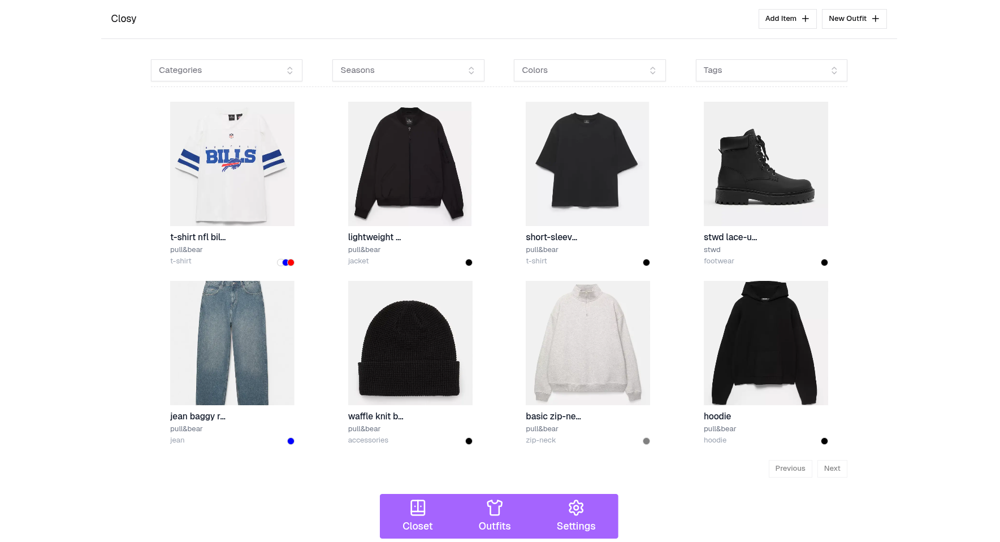
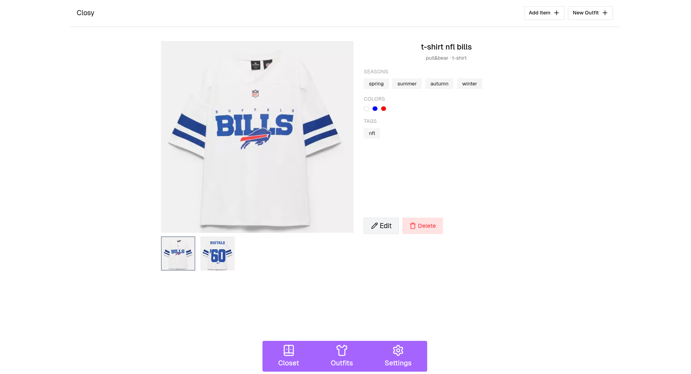
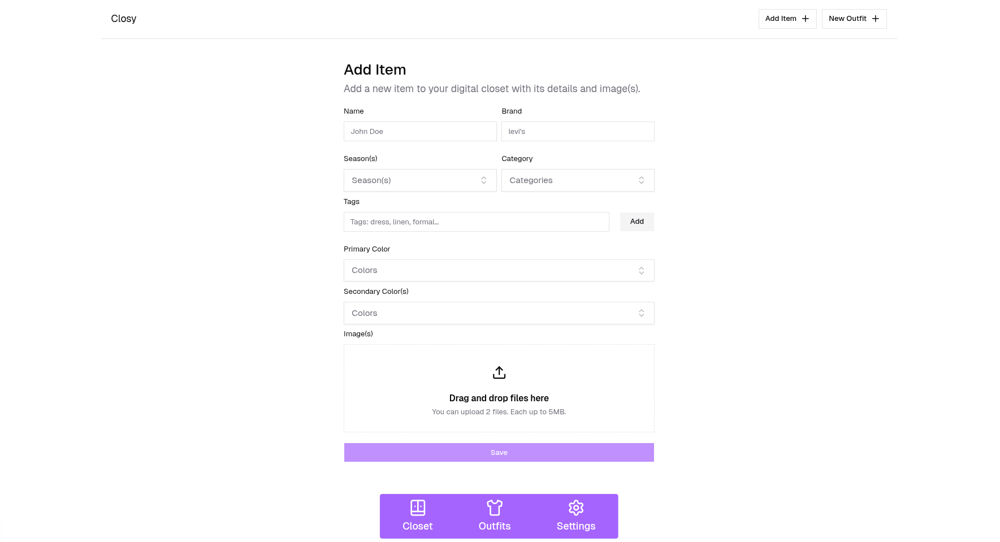
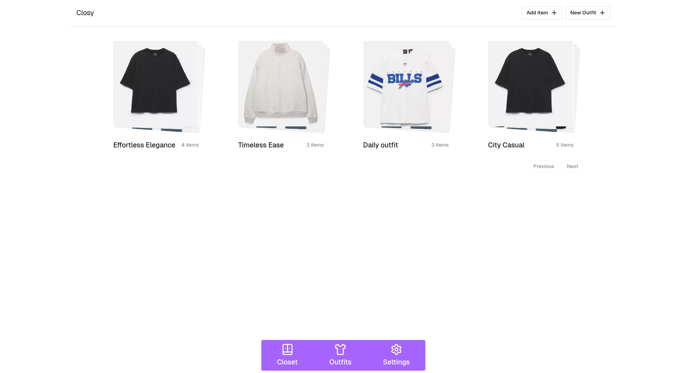
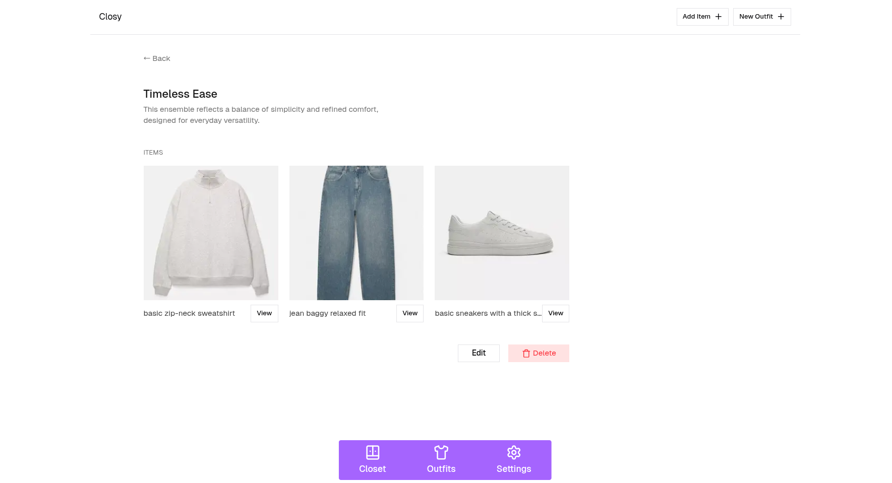
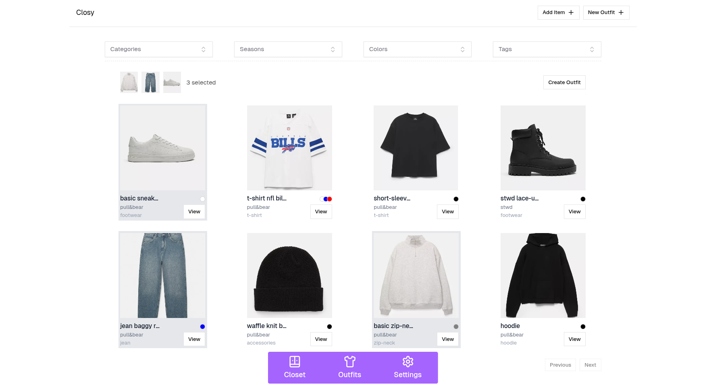
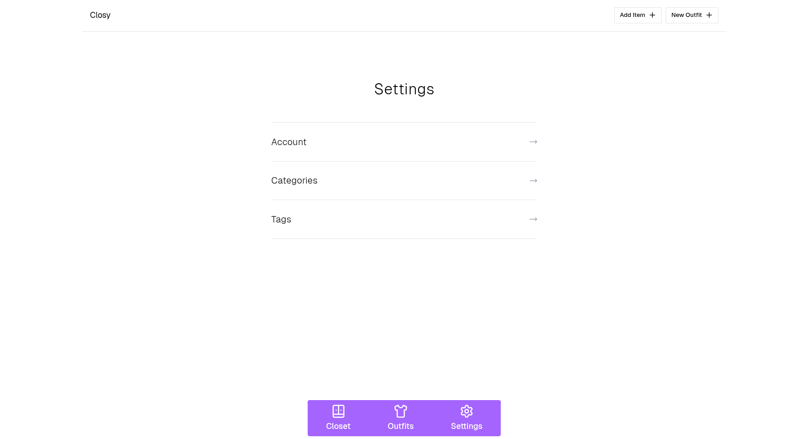

# Digital Closet

A wardrobe manager app for organizing your clothes

## Overview

The app is about organizing your clothes in a easy way, you can add an item, name it, set a brand name, category and upload the item's image(s)...
also you can build outfits from the available items you have added.

the app is for people who struggle managing their closet and building outfits, to avoid closet chaos

## Features

- Add items with season, colors, tags, images
- Organize items into categories
- Build outfits from saved items
- Secure authentication and protected user data

## Tech Stack

- Next.js (App Router)
- TypeScript
- Better-Auth
- PostgreSQL
- AWS S3 (image storage)
- Tailwind CSS
- Zod (schema validation)

## Database Design

- categories → items (one-to-many)
- items ↔ tags (many-to-many)
- outfits ↔ items (many-to-many)

## Local Setup

```bash
git clone https://github.com/yahrour/digital-closet
cd digital-closet
```

**Requirements**

- Docker
- Docker Compose
- AWS S3 Bucket

## Environment Variables

Rename `.env.example` to `.env` in the project root and fill in the following values.

### Database (App Connection)

These variables are used by the application to connect to PostgreSQL:

- `DB_USER` — Database user used by the app (should match `POSTGRES_USER`)
- `DB_PASSWORD` — Password for the database user (should match `POSTGRES_PASSWORD`)
- `DB_NAME` — Name of the application database (should match `POSTGRES_DB`)

### PostgreSQL (Docker Initialization)

These variables are used by the official PostgreSQL Docker image when starting the container:

- `POSTGRES_USER` — Initial PostgreSQL user
- `POSTGRES_PASSWORD` — Password for the user
- `POSTGRES_DB` — Database created on first startup

### Authentication

- `BETTER_AUTH_SECRET` — Secret key used to sign and secure user sessions (use a long random string)

### Email Service

- `RESEND_API_KEY` — API key for Resend, used to send verification emails

### AWS S3 (Image Storage)

Used for uploading and retrieving item images:

- `AWS_S3_BUCKET_NAME` — S3 bucket name
- `AWS_S3_ACCESS_KEY` — IAM access key ID
- `AWS_S3_SECRET_KEY` — IAM secret access key

**Run**

```bash
docker compose up --build
```

After the containers start successfully, the app will be available at:

```
http://localhost:3000
```

## Screenshots

### Closet Overview



### Item Details



### Add New Item



### Outfits



### Outfit Details



### Create New Outfit



### Settings


